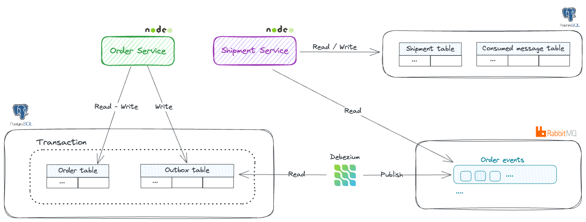

## Transactional outbox pattern

Implementation of _transactional outbox pattern_, a method that allows to atomically perform a local business transaction and send domain events to a message broker. The example leverages
- [NodeJS](https://nodejs.org/en) as services runtime.
- [Debezium](https://debezium.io) as CDC platform.
- [RabbitMQ](https://www.rabbitmq.com) as events broker.
- [PostgreSQL](https://www.postgresql.org/) as services data store.

The example includes a _order service_ acting as events producer. It store events in an outbox table and performs regular business operations as part of the same database transaction. Debezium monitors the outbox table streaming new entries to RabbitMQ. The _shipment service_ acts as message consumer reading events from the broker.

High level architecture mirrors the schema below.



## Running locally
The only requirement to run the example locally is [Docker](https://www.docker.com/). Once you have Docker installed on your local machine, all services can be started by running

```console
$ docker compose up --build
```

The repository also includes a [Taskfile](Taskfile.yml) that aliases some commands. In case you'd like to bootstrap all services by using [Task](https://taskfile.dev/) tool you can run

```console
$ task bootstrap
```

## Credits
- The implementation is heavily inspired by the official Debezium outbox [example](https://github.com/debezium/debezium-examples/tree/main/outbox).
- Related [post](https://debezium.io/blog/2019/02/19/reliable-microservices-data-exchange-with-the-outbox-pattern/) on Debezium blog.